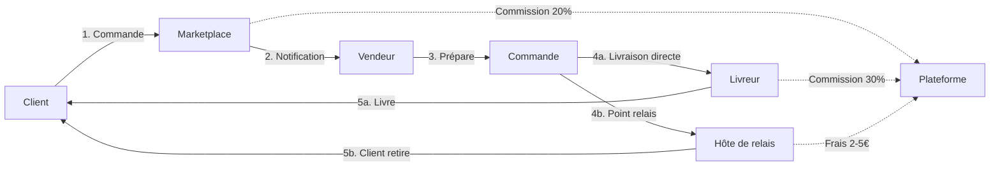
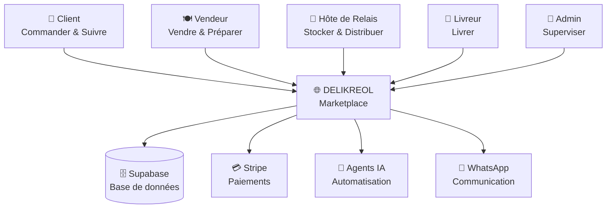

# DELIKREOL - Concept Partenaires

## 🎯 Vision

DELIKREOL est une **marketplace logistique multi-acteurs** qui transforme la livraison locale en Martinique en créant un écosystème collaboratif où chaque participant gagne.

---

## 🌟 Modèle d'affaires

### Pour les Clients
- **Commande simplifiée** : Web, mobile ou WhatsApp
- **Choix flexible** : Livraison à domicile, retrait restaurant ou point relais
- **Suivi temps réel** : Localisation du livreur, notifications automatiques
- **Produits locaux** : Restaurants créoles, producteurs, commerces de proximité

### Pour les Vendeurs (Restaurants, Producteurs, Commerces)
- **Visibilité accrue** : Marketplace avec clients actifs
- **80% des revenus** : Commission plateforme de seulement 20%
- **Gestion facilitée** : Interface simple pour produits et commandes
- **Paiements Stripe** : Virements automatiques et sécurisés
- **0 infrastructure** : Pas de livreurs à gérer

### Pour les Hôtes de Point Relais
- **Revenu complémentaire** : 2-5€ par colis géré
- **Flexibilité** : Horaires configurables
- **Trafic additionnel** : Clients qui viennent retirer = potentiel d'achat
- **Simple** : Application dédiée pour scan QR et gestion

### Pour les Livreurs Auto-Entrepreneurs
- **70% des frais** : Sur chaque livraison
- **Liberté totale** : Choisir ses courses, horaires flexibles
- **Optimisation IA** : Suggestions de courses basées sur position
- **Paiement immédiat** : Virement après livraison confirmée

### Pour la Plateforme (DELIKREOL)
- **20% sur produits** : Commission vendeur
- **30% sur livraison** : Commission logistique
- **Scaling** : Modèle évolutif sans coûts fixes

---

## 📊 Schéma du Flux de Commande

---

## 🏗️ Architecture des Acteurs

---

## 🔄 Cycle de Vie d'une Commande

### 1. **Création** (Client)
- Navigation catalogue vendeurs
- Ajout produits au panier
- Choix mode de livraison :
  - **Livraison à domicile** : +3,50€
  - **Retrait restaurant** : Gratuit
  - **Point relais** : +1,50€

### 2. **Notification** (Vendeur)
- Alerte instantanée (app + WhatsApp)
- Détails commande + coordonnées
- Acceptation et préparation

### 3. **Préparation** (Vendeur)
- Mise à jour statut "En préparation"
- Emballage soigné
- Notification client automatique

### 4a. **Livraison Directe**
- **Assignation automatique** du livreur optimal (IA)
- Navigation GPS intégrée
- Mise à jour position temps réel
- Confirmation de livraison (photo optionnelle)

### 4b. **Point Relais**
- **Suggestion automatique** du relais optimal (IA)
- Génération QR codes (dépôt + retrait)
- Livreur dépose au relais
- Client reçoit notification
- Scan QR pour retrait

### 5. **Paiement** (Automatique)
- Prélèvement client via Stripe
- Répartition automatique :
  - 80% → Vendeur
  - 70% frais livraison → Livreur
  - 20% commission → Plateforme
  - 2-5€ → Hôte relais (si applicable)

---

## 🤖 Automatisation IA

### Assistant Analyse Métier
- **Questions en langage naturel** : "Quels sont mes meilleurs vendeurs ?"
- **Rapports automatiques** : Synthèses journalières, hebdomadaires
- **Recommandations** : Optimisations basées sur données

### Affectation Intelligente
- **Livreur optimal** : Distance, charge de travail, disponibilité
- **Point relais optimal** : Capacité, horaires, proximité
- **Zones dynamiques** : Ajustement selon demande

### Notifications Automatiques
- **WhatsApp Business** : Confirmation, préparation, livraison
- **Email** : Factures, résumés
- **In-app** : Push notifications temps réel

---

## 📍 Carte Interactive Admin

L'administrateur dispose d'une vue cartographique centralisée :

- **Zones de livraison** : Polygones colorés par volume
- **Points relais** : Marqueurs avec état (ouvert, saturé, fermé)
- **Livreurs actifs** : Position temps réel
- **Commandes en cours** : Trajets visualisés

**Actions rapides :**
- Réaffecter un livreur
- Marquer un relais comme saturé
- Ajuster une zone de livraison
- Exporter les données vers Google Sheets

---

## 💰 Simulation Financière

### Exemple : Commande 25€
- **Sous-total produits** : 25,00€
- **Frais livraison** : 3,50€
- **Total client** : **28,50€**

**Répartition :**
- Vendeur reçoit : 25€ × 80% = **20,00€**
- Livreur reçoit : 3,50€ × 70% = **2,45€**
- Plateforme : 25€ × 20% + 3,50€ × 30% = **6,05€**

### Potentiel Point Relais
- Capacité : **30 colis/jour**
- Rémunération : **3€/colis**
- Revenus mensuels : 30 × 3€ × 25 jours = **2 250€**

---

## 🚀 Avantages Compétitifs

### 1. **Hyper-Local**
- Focus Martinique
- Produits créoles authentiques
- Support communauté locale

### 2. **Multi-Canal**
- Web, Mobile, WhatsApp
- Accessible à tous

### 3. **Flexible**
- Choix de livraison
- Horaires adaptés
- Points relais de proximité

### 4. **Automatisé**
- Affectation IA
- Paiements instantanés
- Notifications automatiques

### 5. **Transparent**
- Suivi temps réel
- Historique complet
- Ratings & avis

---

## 📈 Roadmap

### Phase 1 - MVP ✅
- Marketplace web/mobile
- Multi-rôles (client, vendeur, livreur, relais, admin)
- Paiements Stripe
- Cartographie Leaflet
- WhatsApp Business

### Phase 2 - Automatisation 🚧
- IA pour affectation optimale
- Analytics avancés
- Export automatique données
- Prévisions demande

### Phase 3 - Scale 🔮
- Extension Guadeloupe, Guyane
- Application mobile native
- Programme fidélité
- API publique partenaires

---

## 🤝 Devenir Partenaire

### Vendeur
1. Inscription sur delikreol.com
2. Validation admin (24h)
3. Ajout produits
4. Configuration Stripe
5. Commencer à vendre !

### Hôte de Point Relais
1. Candidature (formulaire)
2. Visite de vérification
3. Formation (2h)
4. Installation app
5. Activation point relais

### Livreur
1. Inscription + documents (SIRET, assurance)
2. Validation conformité
3. Formation sécurité
4. Activation compte
5. Premières courses !

---

## 📞 Contact

- **Site** : delikreol.com
- **Email** : contact@delikreol.com
- **WhatsApp** : +596 696 XX XX XX
- **Support** : support@delikreol.com

---

**DELIKREOL** - La marketplace qui fait vivre la Martinique 🌴
